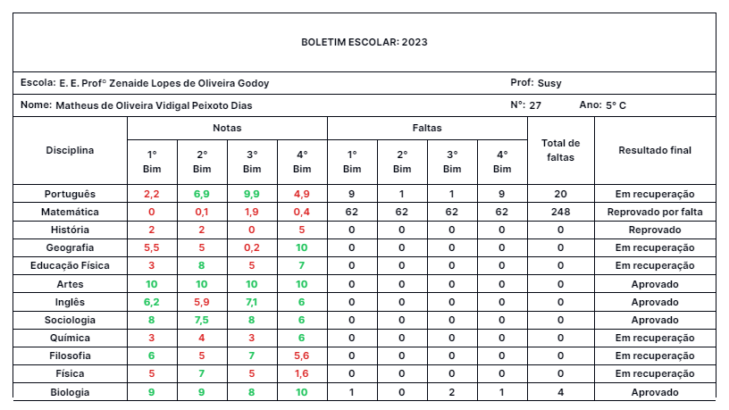
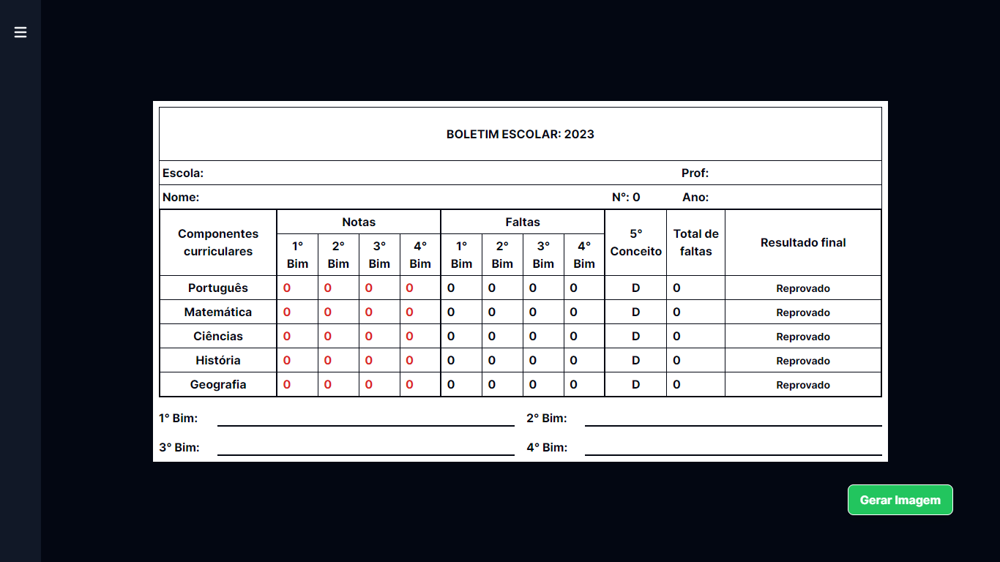
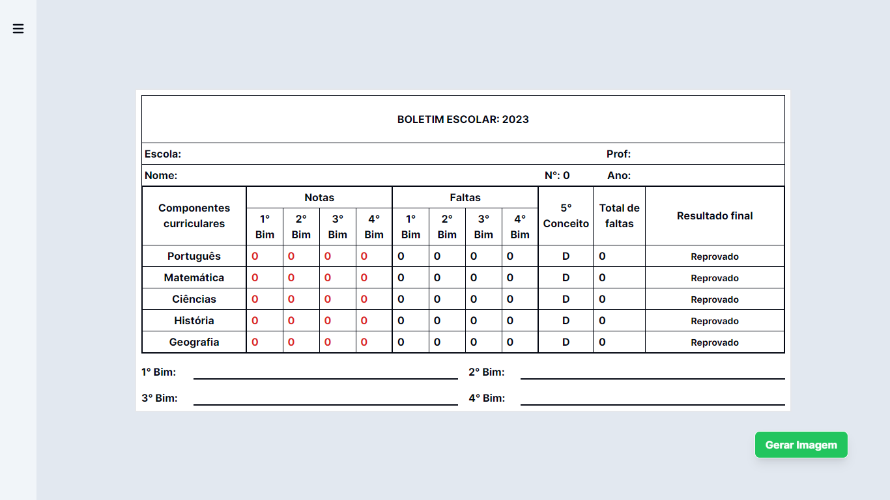
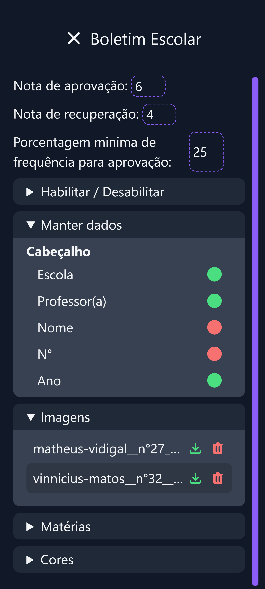
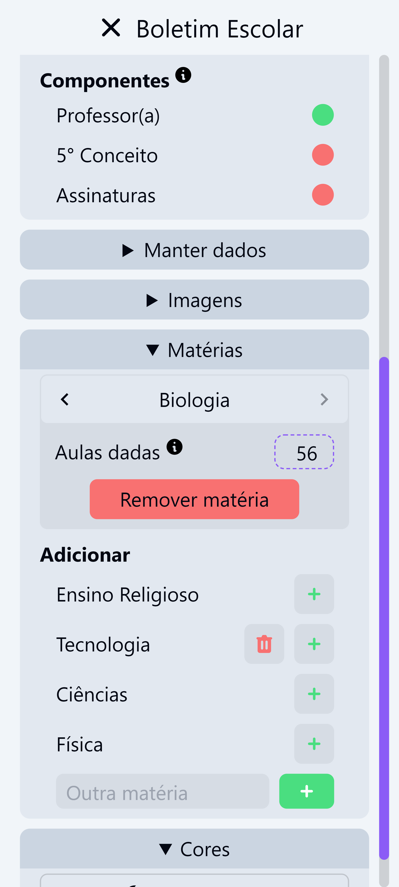

<h1 align="center">
    
</h1>
<p align="center">
    
    
    
    <a href="https://github.com/NyctibiusVII/BoletimEscolar/blob/main/LICENSE">
        
    </a>
</p>
<p align="center">
    <a href="#boletimescolar-">Projeto</a>&nbsp;&nbsp;&nbsp;|&nbsp;&nbsp;&nbsp;
    <a href="#tecnologias-">Tecnologias</a>&nbsp;&nbsp;&nbsp;|&nbsp;&nbsp;&nbsp;
    <a href="#layout-">Layout</a>&nbsp;&nbsp;&nbsp;|&nbsp;&nbsp;&nbsp;
    <a href="#licença-%EF%B8%8F">Licença</a>
</p>

# BoletimEscolar 
Geração de Boletim escolar automatizado e personalizável, para escolas / professores 👩🏻‍🏫📄

#### Funcionalidades
* Habilitar / Desabilitar conteúdos e componentes
    * __Dados__: _Os 4 Bimestres, 5° Conceito e Resultado final_
    * __Componentes__: _Professor(a), 5° Conceito e Assinaturas_
* Mantém dados do formulário nos cookies
    * __Cabeçalho__: _Escola, Prof, Nome, N° e Ano_
* Personalização de dados para o cálculo das notas do boletim escolar
    * _Nota de aprovação, Nota de recuperação, Porcentagem minima de frequência para aprovação e Aulas dadas (por matéria)_
* Gera imagens do boletim escolar feito pelo usuário
    * __Modelo do nome do arquivo__:
        <p>{nome}__n°{numero}__{ano}__{hora}h-{minuto}m-{segundos}s.png</p>
        <p>matheus-de-oliveira-vidigal-peixoto-dias__n°27__3°-a__19h-45m-36s.png</p>
* Matérias podem ser adicionadas e removidas
* Mudança de cores do tema da aplicação e do boletim escolar

## Tecnologias 🚀
Esse projeto foi desenvolvido com as seguintes tecnologias:
- [ReactJS](https://pt-br.reactjs.org)
- [Typescript](https://www.typescriptlang.org)
- [NextJS](https://nextjs.org)
- [TailwindCSS](https://tailwindcss.com)

## Layout 🚧
### Desktop Screenshot
<div style="display: flex; flex-direction: 'column'; align-items: 'center';">
<!-- Responsive, 1366 x 768, 50% (Laptop L - 1366px) -->
    
    
</div>

### Mobile Screenshot
<div style="display: flex; flex-direction: 'row';">
<!-- Responsive, 320 x 711, 75% (Mobile X11T - 320px) -->
    
    
</div>

## Rodando o projeto 🚴🏻‍♂️
#### "Só vou dar uma olhadinha...":
  <a href="https://boletim-escolar.vercel.app">👩🏻‍🏫 Site hospedado na Vercel 📄</a>

#### Na sua maquina:
```bash
# Clone o repositório
$ git clone https://github.com/NyctibiusVII/BoletimEscolar.git

# Acesse a pasta do projeto no terminal
$ cd BoletimEscolar

# Instale as dependências com o gerenciador de pacotes de sua preferência
$ npm install   /   yarn add

# Execute o projeto
$ npm run dev   /   yarn dev

# O projeto roda na porta: 3000

# Acesse http://localhost:$PORT *Ex: Cuidado para não ligar dois ou mais projetos na mesma porta.
```

## Contribuição 💭
Confira a página de [contribuição](./CONTRIBUTING) para ver como começar uma discussão e começar a contribuir.

## Licença ⚖️
Este projeto está sob a licença do MIT. Veja o arquivo [LICENSE](https://github.com/NyctibiusVII/BoletimEscolar/blob/main/LICENSE) para mais detalhes.

## Contribuidores 🦸🏻‍♂️
<a href="https://github.com/NyctibiusVII/BoletimEscolar/graphs/contributors">
    
</a>

<br/>
<br/>

###### Feito com ❤️ por Matheus Vidigal 👋🏻 [Entre em contato!](https://www.linkedin.com/in/matheus-vidigal-nyctibiusvii)